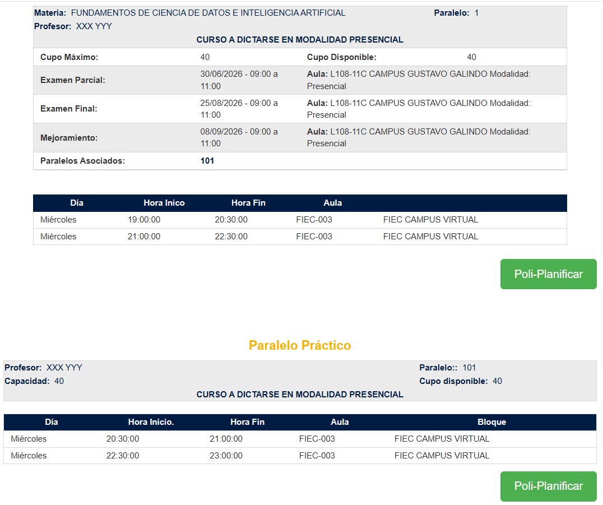
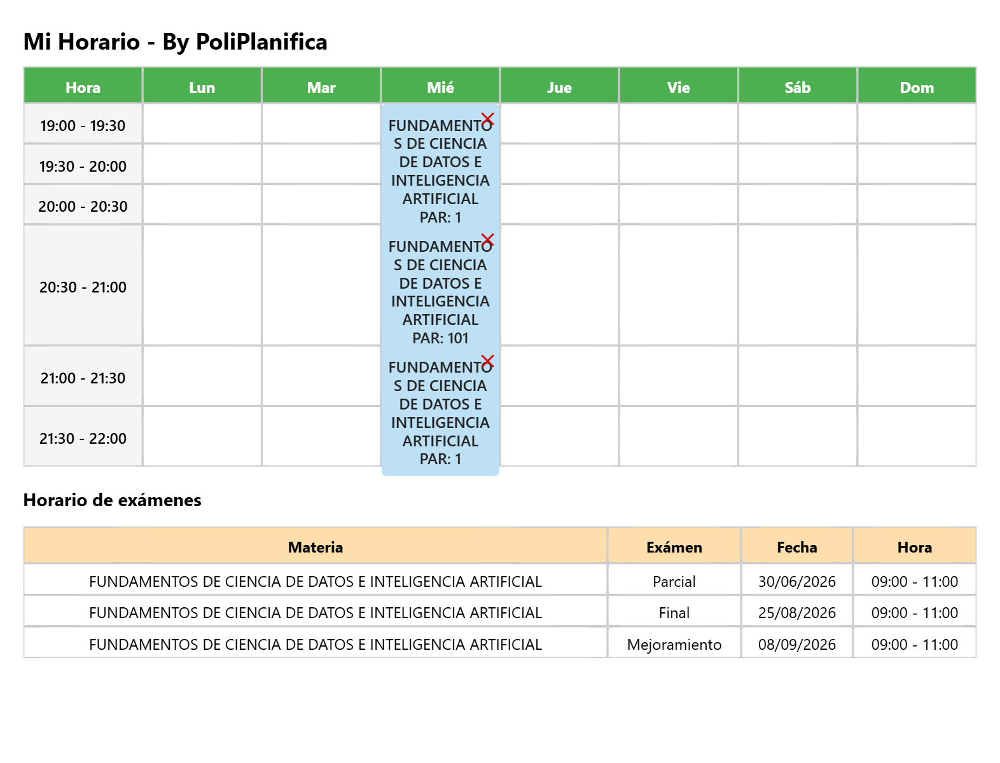

..
  Copyright (c) 2025 Allan Avendaño Sudario
  Licensed under Creative Commons Attribution-ShareAlike 4.0 International License
  SPDX-License-Identifier: CC-BY-SA-4.0

====================
Registro de materias
====================

Planificación
-------------

1. Según tu modalidad de estudio, accede a la malla `híbrida <https://mallacurricular.espol.edu.ec/Malla/Imagen?codCarrera=CI029>`_ o `en Línea <https://mallacurricular.espol.edu.ec/Malla/Imagen?codCarrera=CI030>`_.

2. Identifica el nombre de la materia que deseas planificar. Los códigos sirven para diferenciar la modalidad de la materia. Por ejemplo: **FUNDAMENTOS DE CIENCIA DE DATOS E INTELIGENCIA ARTIFICIAL**. 

.. grid:: 2

    .. grid-item-card::

        .. shield::
            :label: Híbrida
            :message: CDIAG1003
            :label-color: darkgreen
            :message-color: orange
            :link: https://mallacurricular.espol.edu.ec/Malla/Imagen?codCarrera=CI029
            :link-type: url
        

        .. image:: ../archivos/CDIAG1003.png
            :alt: CDIAG1003
            :width: 80%
            :align: center

    .. grid-item-card::

        .. shield::
            :label: En Línea
            :message: CDIAG1811
            :label-color: hsl(270,60%,70%)
            :message-color: rgb(255,0,153)
            :link: https://mallacurricular.espol.edu.ec/Malla/Imagen?codCarrera=CI030
            :link-type: url

        .. image:: ../archivos/CDIAG1811.png
            :alt: CDIAG1811
            :width: 80%
            :align: center

3. Considera las horas teóricas, horas prácticas y horas autónomas de la materia.

.. card:: Horas de la materia

    .. sd-table::
        :widths: 3 9

        .. sd-row::
            .. sd-item:: **Horas**
            .. sd-item:: **Cantidad**

        .. sd-row::
            .. sd-item:: Teóricas
            .. sd-item:: 3

        .. sd-row::
            .. sd-item:: Prácticas
            .. sd-item:: 1
        
        .. sd-row::
            .. sd-item:: Autónomas
            .. sd-item:: 5
        
       
4. Consulta `Académico en Línea <https://www.academico.espol.edu.ec/>`_ y registra ambos paralelos (el **paralelo teórico** y el **paralelo práctico**) de la materia. Haz clic en **Paralelos Asociados** para seleccionar el paralelo práctico de la materia.

.. grid:: 2

    .. grid-item-card::  Híbrida

        .. image:: ../archivos/CDIAG1003_horario.png
            :alt: CDIAG1003 horario
            :width: 80%
            :align: center

    .. grid-item-card::  En Línea

        .. image:: ../archivos/CDIAG1811_horario.png
            :alt: CDIAG1811 horario
            :width: 80%
            :align: center

4. Planifica ambos paralelos de la materia. Puedes usar una hoja de cálculo, programar tu propia aplicación o utilizar la extensión `PoliPlanifica <https://chromewebstore.google.com/detail/poliplanifica/lnielcenbbmofigenbdcdbjdcdbfbcko>`_, p.e.:

5. Revisa el horario de ambos paralelos de la materia y asegúrate de que no haya conflictos con las horas de clases, ni con los exámenes.

Guía de matriculación
---------------------

.. pdf-include:: ../_static/pdf/guiadematriculacion20261.pdf
   :width: 100%
   :height: 600px