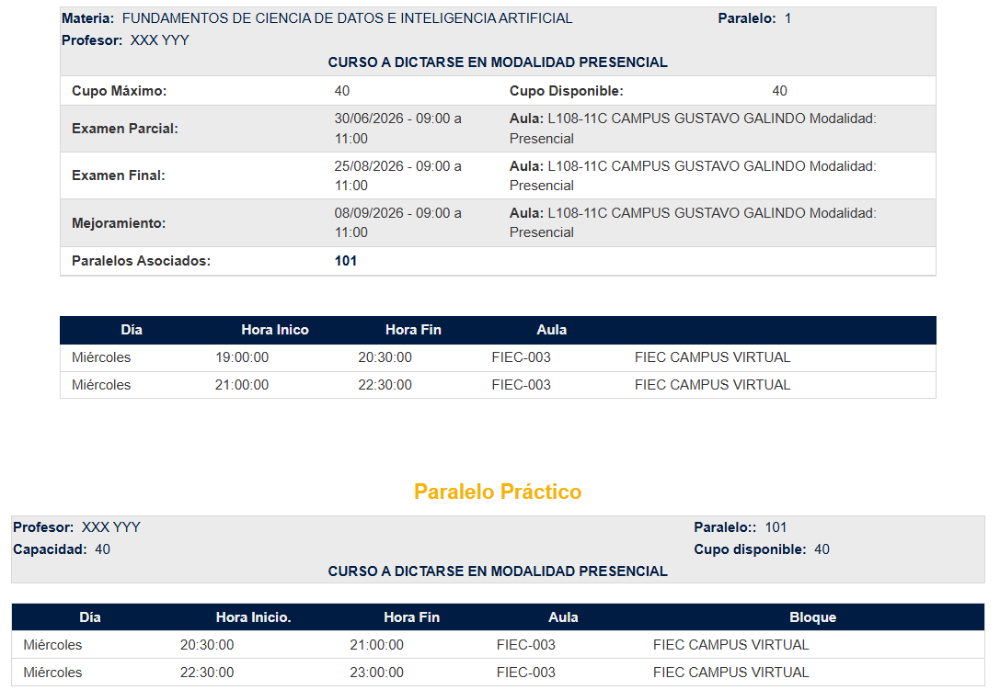

..
  Copyright (c) 2025 Allan Avendaño Sudario
  Licensed under Creative Commons Attribution-ShareAlike 4.0 International License
  SPDX-License-Identifier: CC-BY-SA-4.0

====================
Registro de materias
====================

Planificación
-------------

1. Accede a la malla de tu modalidad de estudios. 

   - `Híbrida <https://www.fiec.espol.edu.ec/es/carreras-de-grado/ciencia-de-datos-e-inteligencia-artificial-hibrida>`_ 
   - `En Línea <https://www.fiec.espol.edu.ec/es/carreras-de-grado/ciencia-de-datos-e-inteligencia-artificial-online>`_

2. Identifica el nombre de la materia y las horas (teóricas, prácticas y autónomas) que deseas planificar. Los códigos sirven para diferenciar la modalidad de la materia.

.. info-card::

    .. grid-item::
        :columns: 12

        | **Nombre** FUNDAMENTOS DE CIENCIA DE DATOS E INTELIGENCIA ARTIFICIAL
        | **Horas teóricas**  3
        | **Horas prácticas** 1
        | **Horas autónomas** 5

    .. grid:: 2

        .. grid-item-card::  Híbrida

            **CDIAG1003**

            .. image:: ../archivos/CDIAG1003.png
                :alt: CDIAG1003
                :width: 80%
                :align: center

        .. grid-item-card::  En Línea

            **CDIAG1811**

            .. image:: ../archivos/CDIAG1811.png
                :alt: CDIAG1811
                :width: 80%
                :align: center

3. Consulta el horario disponible para esa materia en el `Académico en Línea <https://www.academico.espol.edu.ec/>`_.

.. grid:: 2

    .. grid-item-card::  Híbrida

        .. image:: ../archivos/CDIAG1003_horario.png
            :alt: CDIAG1003 horario
            :width: 80%
            :align: center

    .. grid-item-card::  En Línea

        .. image:: ../archivos/CDIAG1811_horario.png
            :alt: CDIAG1811 horario
            :width: 80%
            :align: center

4. Anota los horarios de las materias, tanto de los horas teóricas como de las horas prácticas. Puedes usar un archivo en excel, programar tu propia aplicación o utilizar la extensión `PoliPlanifica <https://chromewebstore.google.com/detail/poliplanifica/lnielcenbbmofigenbdcdbjdcdbfbcko>`_.

Guía de matriculación
---------------------

.. pdf-include:: ../_static/pdf/guiadematriculacion20261.pdf
   :width: 100%
   :height: 600px